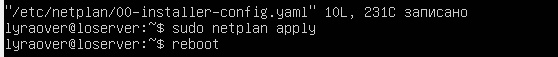
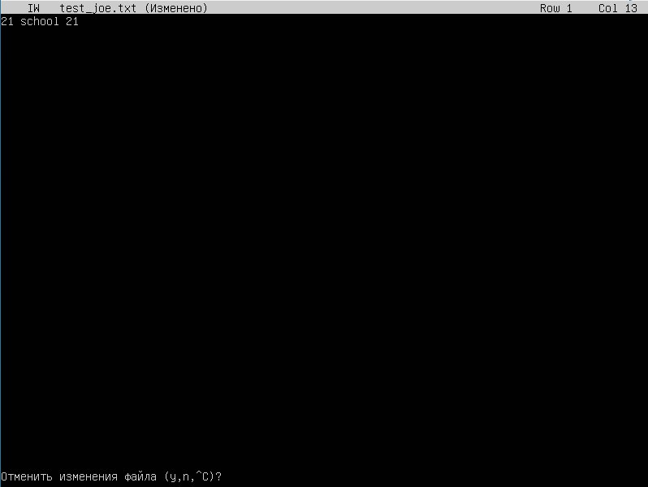
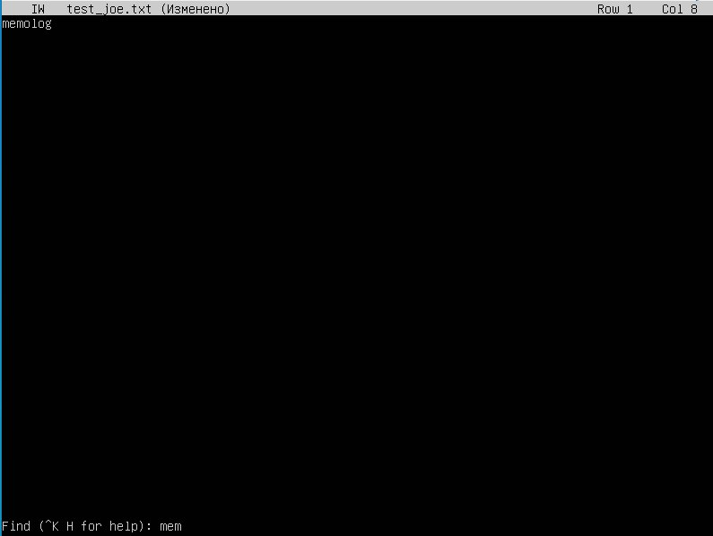
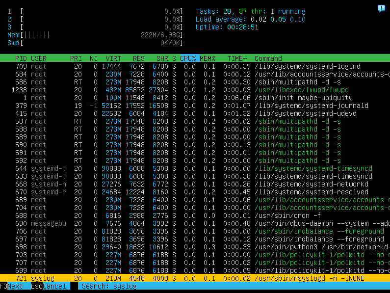
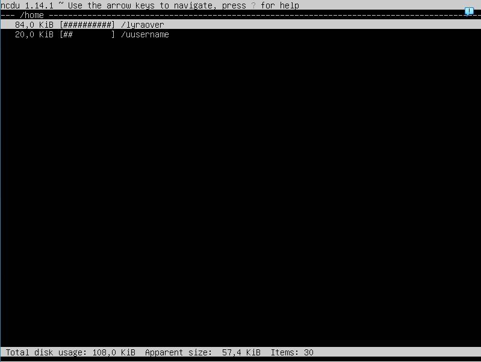

## Part 1. Установка ОС ##
 - Выявление версии Ubuntu.  

## Part 2. Создание пользователя ##
- Cоздание другого пользователя, который входит в группу adm.  

- Вывод всех пользователей списком, созданный находится в конце списка.  

## Part 3. Настройка сети ОС ##
- Устанавливаю новое имя машины.  

- Вывожу на экран новое имя.  

- Устанавливаю временную зону, соответсвующую моему текущему положению.  

- Вывожу на экран установленную временную зону.  

- Прежде чем вывести на экран набор сетевых инструментов, надо их установить командой.  

- Вывожу информацию о наборе сетевых инструментов.  

- **lo** *(loopback device)* – виртуальный интерфейс, присутствующий по умолчанию в любом Linux. Он используется для отладки сетевых программ и запуска серверных приложений на локальной машине. С этим интерфейсом всегда связан адрес 127.0.0.1. У него есть dns-имя – localhost.   

- Так как старый ip существует, удаляю сущетсвующий и получаю новый ip от dhcp сервера.  

- **DHCP** ((Dynamic Host Configuration Protocol англ.) — протокол динамической настройки узла).  

- Вывожу на экран внешний ip-адрес шлюза (ip).  

- Вывожу на экран  внутренний IP-адрес шлюза, он же ip-адрес по умолчанию (gw).  

- Изменяю файл /etc/netplan/*.yaml командой:  

- Задаю настройки файла, дальше применяб изменения в netplan и перезапускаю.  

- Успешно пропинговала удаленные хосты 1.1.1.1 и ya.ru.  

## Part 4. Обновление ОС ##
- Обновила системные пакеты до последней версии.  

## Part 5. Использование команды sudo ##
- Sudo (Superuser do) - команда в Unix-подобных операционных системах, которая позволяет обычному пользователю выполнять команды с привилегиями суперпользователя (root).  
- Данной командой разрешаю пользователю, созданному в Part 2, выполнять команду sudo.  
- Затем переключаюсь на друого пользователя, показываю текущее название и меняю hostname.  

## Part 6. Установка и настройка службы времени ##
- Вывод команды с корректным временем.  
  
Текущее время на компьютере.  

## Part 7. Установка и использование текстовых редакторов ##
- **VIM** Для сохранения и выхода нажала ESC и прописала :wq и имя документа  

- **NANO** Для сохранения нажала ^O, ввёла имя файла и подтвердила. Вышла через ^X  

- **JOE** Для сохранения и выхода нажала ^KX, ввёла имя файла и подтвердила.  

- **VIM** Для выхода без сохранения ESC -> :q! -> ENTER  

- ``**NANO** Для выхода без сохранения ^X -> N  

- **JOE** Для выхода без сохранения ^C -> y  

- **VIM** Для поиска: /что_ищем  

- **VIM** Для замены: :s/что_заменить/чем  

- **NANO** Для поиска: ^W -> что ищем  

- **NANO** Для замены: ^\ -> что заменить -> чем -> Y  

- **JOE** Для поиска: ^K F -> что ищем -> I  

- **JOE** Для замены: ^K F -> что заменить -> R -> чем -> Y  

## Part 8. Установка и базовая настройка сервиса SSHD ##
- Устанавливаю SSH сервер командой: sudo apt install openssh-server.  
- Выполнила комнаду sudo systemctl start ssh.  
- Выполнил команду sudo systemctl enable ssh, добавляет пакет SSH-сервера в автозагрузку.  
**ps** - выводит сведения о процессах в статическом виде.  
**-e** - позволяет выбрать все процессы.  
**| grep sshd** - поиск по выводу через пайп.   

- reboot.  
- netstat -tan.  
  
**-tan**:   
- **-a** -	Показывать состояние всех сокетов; обычно сокеты, используемые серверными процессами, не показываются.  
- **-n** - Показывать сетевые адреса как числа. netstat обычно показывает адреса как символы.  
- **-t** - Отображать TCP подключения.  
- **Proto** - Содержит тип протокола.  
- **Recv-Q** - Счётчик байтов не скопированных программой пользователя из этого сокета.  
- **Send-Q** - Счётчик байтов, не подтверждённых удалённым узлом.  
- **Local Address** - Адрес и номер порта локального конца сокета.  
- **Foreign Address** - Адрес и номер порта удалённого конца сокета.  
- **State** - Состояние сокета.   
- **LISTEN** Сокет ожидает входящих подключений.   
- **SYN_SENT** Сокет, находящийся в режиме активной попытки установки подключения.  
- **0.0.0.0**-  это немаршрутизируемый адрес IPv4, который используется в качестве адреса по умолчанию или адреса-заполнителя.  
## Part 9. Установка и использование утилит top, htop ##
 - uptime - 00:56:21  
 - количество авторизованных пользователей - 1  
 - общую загрузку системы - 0.00 0.01 0.00  
 - общее количество процессов - 28  
 - загрузку cpu - 0.0%, 0.6%, 0.0.   
 - загрузку памяти - 223M/6.98GB  
 - pid процесса занимающего больше всего памяти - 1226  
 - pid процесса, занимающего больше всего процессорного времени - 2087  
 - htop сортировка по PID.  

- htop сортировка по PERCENT_CPU.  

- htop сортировка по PERCENT_MEM.  

- htop сортировка по TIME.  

- htop фильтр по процессу sshd.  

- htop поиск процесса syslog.  

- htop с добавленным выводом hostname, clock и uptime:  
- Нажимаю клавишу F2 для доступа к настройкам.  
- С помощью стрелок нахожу hostname, clock и uptime среди доступных переменных и включаю их.  
 - Нажимаю клавишу F10 для сохранения настроек.  

## Part 10. Использование утилиты fdisk ##
- Название жесткого диск: Disk /dev/sda  
- Размер: 25 GiB  
- Количество секторов: 82800 sectors  
- Размер swap: 42393600 bytes  
- **Swap** - это специально выделенное пространство на жестком диске, которое используется операционной системой Linux как дополнительная виртуальная память.   

## Part 11. Использование утилиты df ##
- Команда df:  
- размер раздела: 11758760   
- размер занятого пространства: 2718080  
- размер свободного пространства: 8421572  
- процент использования: 25%  
- единица измерени: bytes  

- Команда df -Th:  
- размер раздела: 12G  
- размер занятого пространства: 2,6G  
- размер свободного пространства: 8,1G  
- процент использования: 25%  
- тип файловой системы для раздела:ext4  

## Part 12. Использование утилиты du ##
- Команду du:  

- Вывожу размер папок:  
- /home в байтах:  

- /var в байтах:  

- /var/log в байтах:  

- Вывожу размер всего содержимого /var/log:  

## Part 13. Установка и использование утилиты ncdu ##
- Установка ncdu:  

- /home:  

- /var:  

- /var/log:  

## Part 14. Работа с системными журналами ##
- Последняя авторизация:  

- Перезапуск OpenSSH Server:  

## Part 15. Использование планировщика заданий CRON ##
- Создание задачи в cron:  

- Uptime каждые 2 минут:  

- Вывела список задач:  

- Удалила все задачи вывела список:  
