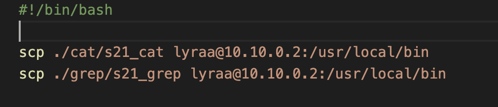

### Part 1. Настройка **gitlab-runner**

- подняла вирутальную машину


- Дальше я скачала gitlab-runner
``curl -L "https://packages.gitlab.com/install/repositories/runner/gitlab-runner/script.deb.sh" | sudo bash
``


- Следующий шаг устнановить gitlab runner:
``sudo apt install gitlab-runner``


- Запустила gitlab-runner 
``sudo gitlab-runner start ``

- Зарегистрировалсь 
``sudo gitlab-runner register ``


### Part 2. Сборка

- Перенесла дирректории cat и grep из проекта C2_SimpleBashUtils

- Создала файл gitlab-ci.yml в корне дирректории 


 
 - Запустила pipline:

 

 ### Part 3. Тест кодстайла

 - Напиши этап для CI, который запускает скрипт кодстайла (clang-format).

  

- Перед этим установливаю на ВМ clang-format:
``` sudo apt-get install clang-format ```

- В данной ситуации тест на кодстайл прошел:


Вывод утилиты clang-format.


### Part 4. Интеграционные тесты

- Напиши этап для CI, который запускает твои интеграционные тесты из того же проекта.

- Написала этап


- Запускаю этап


- Вывод пайплайна

- у кэта тесты проходят полностью 


- у грепа не все тесты


### Part 5. Этап деплоя

**== Задание ==**

- Подняла вторую виртуальную машину *Ubuntu Server 22.04 LTS*.


Написать этап для **CD**, который «разворачивает» проект на другой виртуальной машине.

- Изменяю файл /etc/netplan/50-cloud-init.yaml на обеих машинах:


-  Перенастраиваю сетевые адаптеры обеих машин следующим образом:


- Проверяю соедение


- Скачиваю на вторую виртуальную машину, иначе ключ не перекинется
``` sudo apt-get install ssh ```
- Захожу на первой машине под пользователя gitlab-runner
``` sudo su gitlab-runner ```
- Создаю ключ (ssh-keygen) и копируем его на вторую машину
``` ssh-copy-id lyraa@10.10.0.2 ``` 


- Теперь могу подключаться ко второй машине через ssh без необходимости ввода пароля:


- На второй машине дам права для папки /usr/local/bin/ командой 
``` sudo chmod -R 777 /usr/local/bin ``` 


- Написанный скрипт



- В файле _gitlab-ci.yml_ добавила этап запуска написанного скрипта.


- Пайплайн:


- Получила готовые к работе приложения из проекта *C2_SimpleBashUtils* (s21_cat и s21_grep) на второй виртуальной машине:


Сохранила дампы образов виртуальных машин:


### Part 6. Дополнительно. Уведомления

- Напиcала @botfather, чтобы создать бота и получить его токен:


- Добавляю в скрипт:


- Пишу своему боту


- Мне нужно получить id чата. Для этого в адресной строке браузера забиваю https://api.telegram.org/bot<тут_твой_токен>/getUpdates, он показывает последние изменения в чате, там и достаю айди чата


- Дальше скрипт пишу


- Бот показывает уведомления


