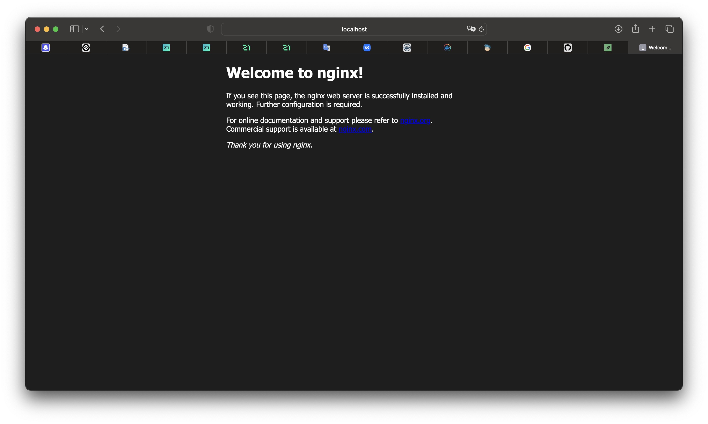
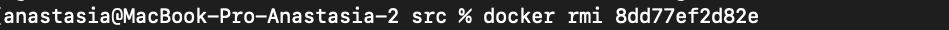
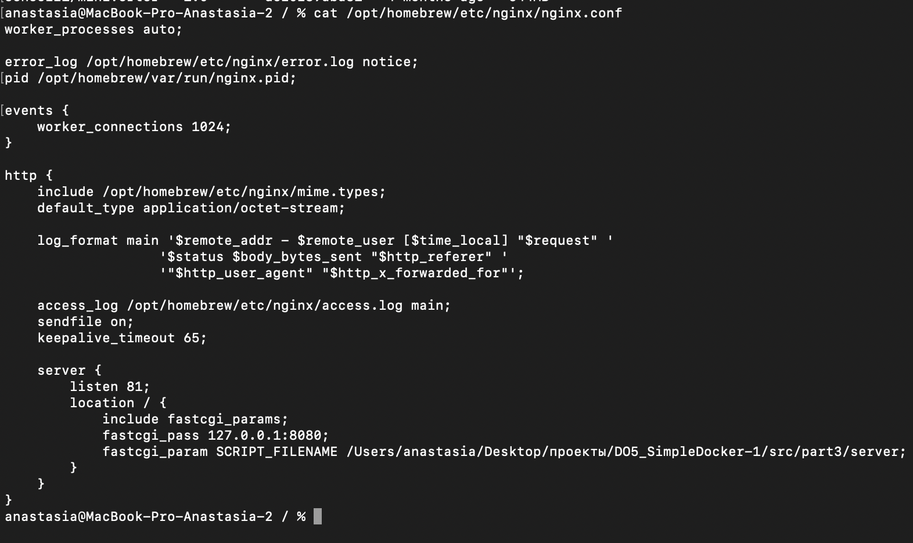
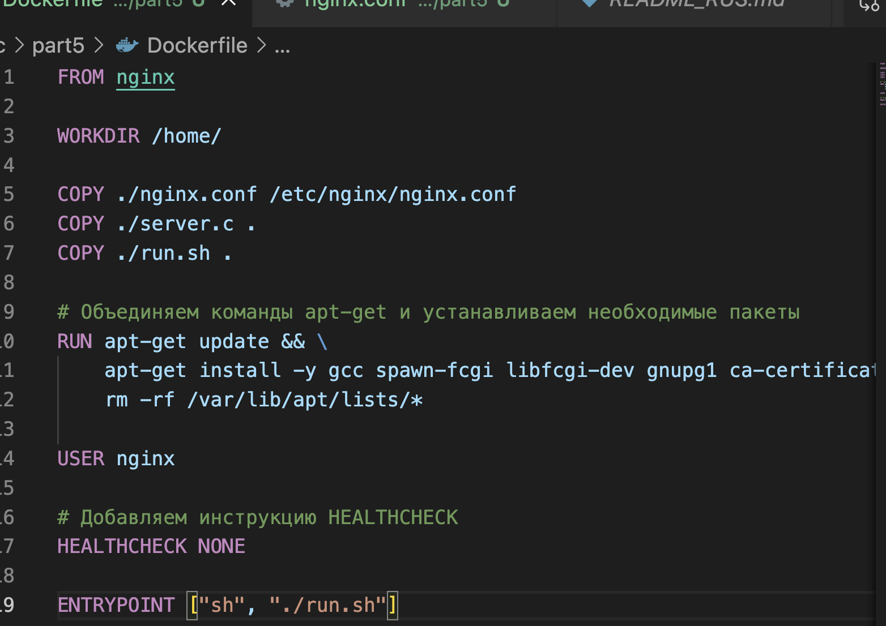

##### Возьми официальный докер-образ с **nginx** и выкачай его при помощи `docker pull`.
  
##### Проверь наличие докер-образа через `docker images`.
  
##### Запусти докер-образ через `docker run -d [image_id|repository]`.
  
##### Проверь, что образ запустился через `docker ps`.
  
##### Посмотри информацию о контейнере через `docker inspect [container_id|container_name]`.
  
##### По выводу команды определи и помести в отчёт размер контейнера, список замапленных портов и ip контейнера.
  
   
    
##### Останови докер образ через `docker stop [container_id|container_name]`.
  
##### Проверь, что образ остановился через `docker ps`.
  
##### Запусти докер с портами 80 и 443 в контейнере, замапленными на такие же порты на локальной машине, через команду *run*.
  
##### Проверь, что в браузере по адресу *localhost:80* доступна стартовая страница **nginx**.
  
##### Перезапусти докер контейнер через `docker restart [container_id|container_name]`.
  
##### Проверь любым способом, что контейнер запустился.

## Part 2. Операции с контейнером

##### Прочитай конфигурационный файл *nginx.conf* внутри докер контейнера через команду *exec*.
 
##### Создай на локальной машине файл *nginx.conf*.
##### Настрой в нем по пути */status* отдачу страницы статуса сервера **nginx**.
 

##### Скопируй созданный файл *nginx.conf* внутрь докер-образа через команду `docker cp`.
 
##### Перезапусти **nginx** внутри докер-образа через команду *exec*.
 
##### Проверь, что по адресу *localhost:80/status* отдается страничка со статусом сервера **nginx**.
 
##### Экспортируй контейнер в файл *container.tar* через команду *export*.
 
##### Останови контейнер.
 
##### Удали образ через `docker rmi [image_id|repository]`, не удаляя перед этим контейнеры.
 
##### Удали остановленный контейнер.
 
##### Импортируй контейнер обратно через команду *import*.
 
##### Запусти импортированный контейнер.
 
##### Проверь, что по адресу *localhost:80/status* отдается страничка со статусом сервера **nginx**.
 

## Part 3. Мини веб-сервер

##### Напиши мини-сервер на **C** и **FastCgi**, который возвращает страничку с надписью `Hello World!`.

 
##### Запусти написанный мини-сервер через *spawn-fcgi* на порту 8080.

 
##### Напиши свой *nginx.conf*, который будет проксировать все запросы с 81 порта на *127.0.0.1:8080*.

 
- Это файл конфигурации был написан в соотвествии с папками на моем компе, так как nginx был установлен через brew, а этот файл конфигураций уже исправлен в контейнере под то расположение папок.

 
- Создала контейнер командой docker run -d -p 81:81 nginx, в которой докер ран создает и запускае  контейнер, флаг -d запускает контейнер в фоновом режиме, -p 81:81 связывает порт 81 на вашем хосте с портом 81 внутри контейнера.

- Скопировала файл сервера и конфигурационный в контейнер

 
- Зашла в контейнер

 
- Установила необходимые инструменты командой
apt update
apt install -y build-essential libfcgi-dev
apt install -y vim

- Скомпилировала server.c 

 
- Запустила через spawn-fcgi

 
- Перезапустила

 
- Проверила, что в браузере по localhost:81 отдается написанная вами страничка

 
 

## Part 4. Свой докер
- Создала докерфайл и entrypoint

 

 

- Собрала написанный докер-образ через `docker build` при этом указав имя и тег.

 

- Проверила через `docker images`, что все собралось корректно.

 

- Запустила собранный докер-образ с маппингом 81 порта на 80 на локальной машине и маппингом папки *./nginx* внутрь контейнера по адресу, где лежат конфигурационные файлы **nginx**'а.

 

- Проверила, что по localhost:80 доступна страничка написанного мини сервера.

 

- Проверила, что теперь по *localhost:80/status* отдается страничка со статусом **nginx**

 

## Part 5. **Dockle**

После написания образа никогда не будет лишним проверить его на безопасность.
- Устанавливаю докли командой

brew install dockle

- Командой 

dockle run -rm -v /var/run/docker.sock:/var/run/docker.sock goodwithtech/dockle new_server:1.0

- Сканирую образ из предыдущего задания

 

- Исправила докер файл

 

- Проверила

 

## Part 6. Базовый **Docker Compose**

- Для начала необходимо устновить docker-compose, если он не устновился с docker. 

- Потом необходимо остановить существующие к контейнеры.

- Командой docker stop [id_container]

- Напишем конфигурационный файл docker-compose.yml

 

 - Пересобираем командой 'sudo docker compose build' и запускам 'docker compose up -d':

  

  

  - Контейнеры поднялись, проверяем в барузере ответ:

  
